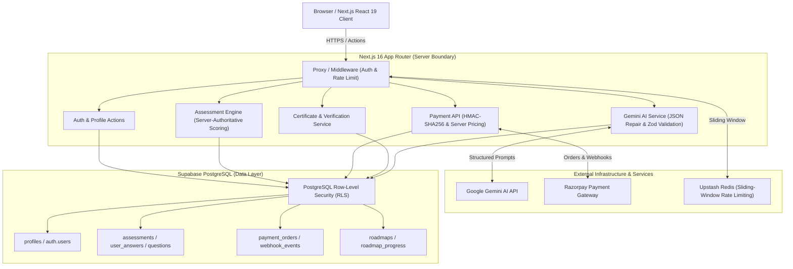

# ReadyCheck AI

> AI-assisted technical skill assessment, structured career roadmap generation, and verifiable credentialing platform built with Next.js 16, Supabase, Gemini AI, and Razorpay.

[](.github/workflows/ci.yml)
[](src/__tests__/)
[](https://nextjs.org/)
[](https://react.dev/)
[](https://www.typescriptlang.org/)
[](https://supabase.com/)
[](https://razorpay.com/)

---

## Overview

ReadyCheck AI is a full-stack assessment and career-readiness application designed to evaluate AI engineering competencies through timed, proctored assessments, generate adaptive learning roadmaps, and issue cryptographically verifiable credentials.

Rather than relying on client-side state, the platform enforces **server-authoritative correctness**: assessment answer keys are never delivered to the client, pricing and entitlements are resolved strictly on the backend, payment signatures use cryptographic HMAC-SHA256 verification, and database access is constrained by PostgreSQL Row-Level Security (RLS).

---

## Key Capabilities

### 1. Timed Technical Assessments
- **Server-Authoritative Scoring:** Assessment questions are delivered to the client without answer keys or scoring weights; evaluation occurs entirely inside protected server actions.
- **Session Integrity & Anti-Cheat:** Tracks client violation telemetry (tab switches, paste attempts, blur events) and enforces per-question and total time budgets.
- **Multi-Track Certification:** Four progressive certification tiers — **RCAF** (Foundations), **RCAP** (Practitioner), **RCGS** (GenAI Specialist), and **RCSA** (Solutions Architect).

### 2. AI-Driven Roadmap Generation
- **Structured Gemini AI Output:** Converts user diagnostics and skill deficits into structured, phase-by-phase learning plans validated with Zod schemas.
- **Resilient JSON Parser:** Includes an algorithmic JSON repair utility that safely recovers from truncated or malformed LLM responses.
- **Persistent Checklists:** User progress and module completion states are stored and synchronized via dedicated Supabase tables.

### 3. Payment Processing & Subscriptions
- **Server-Side Price Validation:** Canonical pricing is derived from server-side configuration, preventing client-side price tampering.
- **HMAC-SHA256 Verification:** Verifies payment authenticity via cryptographic signatures (`razorpay_order_id|razorpay_payment_id`).
- **Webhook Deduplication & Replay Protection:** Webhooks are verified and deduplicated using database idempotency logs before granting subscription entitlements.
- **Development Demo Mode:** Safe local simulation mode for testing checkout flows without touching live payment networks.

### 4. Credentialing & Verification
- **Verifiable Credentials:** Generates certificates with unique verification codes and public verification endpoints (`/verify/[code]`).
- **Digital Signatures:** Supports cryptographic signing and checksum verification to detect credential forgery.

### 5. Role-Based Access Control & Auditing
- **Zero-Trust Database Security:** Every table is protected with Supabase Row-Level Security (RLS) policies ensuring users can only read/write their own records.
- **Server Role Enforcement:** Administrative operations verify roles from secure database profiles, ignoring client-writable JWT user metadata.
- **Admin Audit Trail:** Logs sensitive administrative actions (question edits, role checks, moderation) to an immutable audit table.

### 6. Rendering & Performance Engineering
- **Concurrent Data Fetching:** Multi-tier assessment assembly and subscription catalogs utilize `Promise.all` to eliminate sequential database roundtrips.
- **Adaptive 3D Visuals:** WebGL particle topologies adapt dynamically to device capabilities (35 particles on mobile, 75 on desktop) with automatic Page Visibility suspension.
- **Accessibility & Motion Safety:** Honors `prefers-reduced-motion` to bypass heavy canvas animations for sensitive users while preserving design elegance.

---

## Architecture



---

## Security Model

| Boundary | Mechanism | Implementation |
| :--- | :--- | :--- |
| **Authentication** | Supabase SSR Auth | HTTP-only session cookies, server-side session refreshes via middleware |
| **Authorization** | Server RBAC | Roles queried from PostgreSQL `profiles` table; client-controlled metadata is not trusted |
| **Database** | PostgreSQL RLS | Fine-grained policies per table; service-role key restricted strictly to trusted server contexts |
| **Assessment Integrity** | Secret Answer Keys | Correct answers and scoring weights remain exclusively on the server |
| **Payments** | Cryptographic HMAC | `crypto.createHmac('sha256')` validation over order and payment IDs |
| **Rate Limiting** | Sliding Window | Redis sliding window with in-memory fallback for local development |
| **Input Sanitization** | Multi-Layer | Strict Zod schemas on all API inputs; DOMPurify sanitization for rich text |

> **Note on Rate Limiting Fallback:** When Redis is unavailable or unconfigured, the application falls back to an in-memory rate limiter that is local to the active Node.js process and not distributed across multiple server instances.

---

## Tech Stack

| Domain | Technologies |
| :--- | :--- |
| **Framework** | Next.js 16 (App Router, Server Actions, Standalone Output) |
| **Frontend** | React 19, TypeScript 5.9, Tailwind CSS, Lucide Icons, Recharts |
| **Database** | Supabase (PostgreSQL with Row-Level Security) |
| **AI Integration** | Google Gemini Generative AI SDK (`@google/generative-ai`) |
| **Payment Gateway** | Razorpay Node.js SDK (HMAC-SHA256 verification) |
| **Rate Limiting** | Upstash Redis (`@upstash/redis`) with in-memory fallback |
| **Testing** | Vitest 4, React Testing Library, V8 Coverage |
| **Tooling & CI** | ESLint, TypeScript Strict Mode, GitHub Actions, Docker |

---

## Project Structure

```text
readycheckai/
├── .github/
│   └── workflows/
│       └── ci.yml               # Automated CI (lint, typecheck, tests, build)
├── database/
│   ├── 01_combined_core_systems.sql      # Core tables, enums, and RLS policies
│   └── 02_combined_advanced_features.sql # Roadmaps, audit logs, deduplication
├── public/                      # Static assets and PWA manifest
├── src/
│   ├── app/                     # Next.js App Router pages and API routes
│   │   ├── admin/               # RBAC-protected administrative dashboard
│   │   ├── api/                 # Payments, webhooks, certificates, health endpoints
│   │   ├── assess/              # Assessment flow, timer, and results views
│   │   ├── auth/                # Authentication routes (login, signup, reset)
│   │   ├── dashboard/           # User dashboard, profile, and billing
│   │   ├── roadmap/             # AI roadmap generator and progress tracking
│   │   └── verify/              # Public certificate verification
│   ├── components/              # Shared UI and layout components
│   ├── contracts/               # Type definitions and domain contracts
│   ├── features/                # Domain-driven feature modules (actions & views)
│   │   ├── admin/
│   │   ├── assessment/
│   │   ├── auth/
│   │   ├── certificate/
│   │   ├── dashboard/
│   │   ├── profile/
│   │   └── roadmap/
│   ├── lib/                     # Server utilities (Gemini, Razorpay, Supabase, Security)
│   ├── proxy.ts                 # Request routing and security proxy
│   └── __tests__/               # Automated unit, integration, and security tests
├── Dockerfile                   # Multi-stage standalone production container
├── next.config.mjs              # Next.js 16 standalone build configuration
├── package.json                 # Project dependencies and script declarations
├── tsconfig.json                # Strict TypeScript configuration
└── vitest.config.ts             # Vitest test runner configuration
```

---

## Getting Started

### Prerequisites
- **Node.js**: `v20.x` or later
- **npm**: `v10.x` or later
- **Supabase Account**: Free or Pro tier project

### 1. Clone the Repository
```bash
git clone https://github.com/rohit-sinha-76/readycheckai.com.git
cd readycheckai.com
```

### 2. Install Dependencies
```bash
npm ci --legacy-peer-deps
```

### 3. Configure Environment Variables
Copy the environment template:
```bash
cp .env.example .env.local
```

Populate the required credentials in `.env.local`:
```ini
# Supabase Configuration
NEXT_PUBLIC_SUPABASE_URL=https://your-project.supabase.co
NEXT_PUBLIC_SUPABASE_ANON_KEY=your-supabase-anon-key
SUPABASE_SERVICE_ROLE_KEY=your-supabase-service-role-key

# Google Gemini AI
GEMINI_API_KEY=your-gemini-api-key

# Razorpay (Test Keys)
RAZORPAY_KEY_ID=rzp_test_your_key_id
RAZORPAY_KEY_SECRET=your_razorpay_secret
RAZORPAY_WEBHOOK_SECRET=your_webhook_secret
RAZORPAY_DEMO_MODE=true
```

### 4. Set Up Database Schema
Run the database setup scripts in your Supabase SQL Editor in order:
1. `database/01_combined_core_systems.sql`
2. `database/02_combined_advanced_features.sql`

### 5. Run the Local Development Server
```bash
npm run dev
```
Open [http://localhost:3000](http://localhost:3000) in your browser.

---

## Testing & Quality Assurance

The repository includes automated unit, integration, and security test suites executed via Vitest.

```bash
# Run test suite
npm test

# Run tests with code coverage report
npm run test:coverage

# Run ESLint code quality check
npm run lint

# Run strict TypeScript type check
npx tsc --noEmit

# Build production bundle
npm run build
```

### Test Suite Status
- **250 / 250 tests passing** across 16 test files (100% pass rate).
- Test suites cover: input sanitization, CSRF/OWASP headers, server assessment scoring, authentication contracts, payment signature verification, and LLM JSON parser fault tolerance.

---

## Continuous Integration

The repository uses GitHub Actions (`.github/workflows/ci.yml`) to validate every pull request and commit against the `main` branch.

```text
GitHub Push / Pull Request
           │
           ▼
    npm ci --legacy-peer-deps
           │
           ▼
    npm run lint (ESLint)
           │
           ▼
    npx tsc --noEmit (TypeScript)
           │
           ▼
    npm run build (Next.js Standalone Build)
           │
           ▼
    npm run test:coverage (Vitest)
```

The CI pipeline runs without dependencies on live third-party credentials by utilizing deterministic test doubles and isolated configuration fixtures.

---

## Known Limitations

- **Rate Limiting Fallback:** The in-memory rate limiting fallback operates on a per-instance basis. In a multi-replica serverless setup, provisioning Upstash Redis is recommended for distributed rate limit enforcement.
- **Payment Demo Mode:** The `RAZORPAY_DEMO_MODE=true` setting enables zero-cost subscription testing for staging environments and must be set to `false` for live deployments.
- **PDF Certificate Rendering:** Client-side certificate rendering relies on `html2canvas` and standard browser canvas rendering APIs; rendering fidelity may vary slightly across mobile browsers.

---

## License

This project is licensed under the [ISC License](LICENSE).
